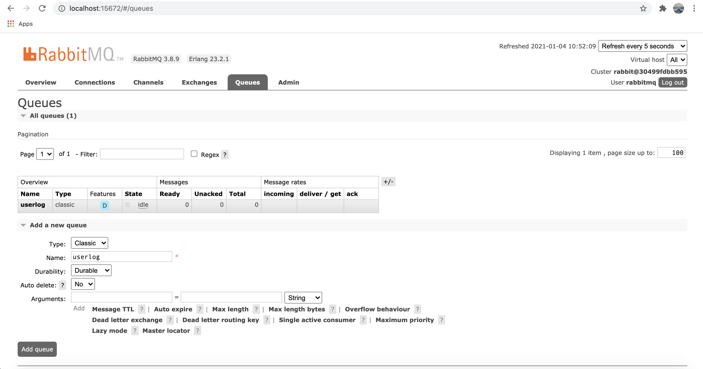

# Online shopping application backend-skeleton
- [System Design](#system-design)
- [Software development principles](#software-development-principles)
    - [DRY](#dry)
    - [KISS](#kiss)
    - [SOLID](#solid)
    - [Clean Architecture](#clean-architecture)
- [Project folder structure and framework](project-folder-structure-and-framework)
- [How to run the application](#how-to-run-the-application)
- [APIs Document](#apis-document)

## System Design

- **Product Service**: Manages our products. This service also provides the ability to allow user could filter, sort and search for products based on dynamic criteria.
- **Userlog Service**: Records customers activities (updating, filtering, sorting, viewing product detail).
- **ShopCart Service**: Manages customer's shopping carts.
- **Order Service**: Manages customer orders.
- **Keycloak Service**: Identity and access management, manages user, roles and scopes. [Have not implemented yet]
- **API Gateway**: Route requests to multiple services using a single endpoint.

## Software development principles

### DRY
DRY stand for "Don't Repeat Yourself," a basic principle of software development aimed at reducing repetition of information

### KISS
The KISS principle is descriptive to keep the code simple and clear, making it easy to understand

### SOLID
The SOLID Principles are five principles of Object-Oriented class design. They are a set of rules and best practices to follow while designing a class structure
- **The Single Responsibility Principle (S)**: A class should do one thing and therefore it should have only a single reason to change.
- **The Open-Closed Principle (O)**: Classes should be open for extension and closed to modification.
- **The Liskov Substitution Principle (L)**: Subclasses should be substitutable for their base classes.
- **The Interface Segregation Principle (I)**: Keeping things separated, and the Interface Segregation Principle is about separating the interfaces.
- **The Dependency Inversion Principle (D)**: Our classes should depend upon interfaces or abstract classes instead of concrete classes and functions.

### Clean Architecture
Clean architecture refers to organizing the project so that it's easy to understand and easy to change as the project grows. This doesn't happen by chance. It takes intentional planning.

## Project folder structure and framework

- **Configuration package**: Contains logics to tie bussiness rule and external framework or library
- **Delivery package**: Contains logic to send/receive request from user/service for handling 
- **Persistence package**: Contains logic for saving data into database or file server...
- **Core package**: Contains bussiness model and bussiness rule only, it does not use any library or framework for supporting

- **Library/Framework**: Java 8, Spring (boot, cloud, security, jpa), hibernate validate, junit, flyway, rabbitmq, mongodb, postgres, redis cache

## How to run the application

- Install [JDK 11](https://www.oracle.com/java/technologies/javase-jdk11-downloads.html).
- Install [Docker for Desktop](https://www.docker.com/products/docker-desktop).
- Install [Maven](https://maven.apache.org/download.cgi?Preferred=ftp://mirror.reverse.net/pub/apache/).
- Clone source, go to folder ../icom
- Open terminal and run command: docker-compose up (ensure docker-compose.yml file in the same folder)
- Configuration RabbitMQ
- Go to: http://localhost:15672/ and login with account: rabbitmq/rabbitmq
- Create Queue, Exchange and Binding as below

Create Queue

Create Exchange

Create Binding

- Build and Run services: 
Go to each service folder: ../icom/gateway, ../icom/product, ../icom/order, ../icom/shopcard, ../icom/userlog
And run command: mvn clean install && java -jar target/<service-name>-0.0.1-SNAPSHOT.jar

## APIs Document

**Product service**

- Find Products
curl --location --request GET 'http://localhost:9090/product-service/v1/products?search=name:*,colour:*&sort=price-&page=0&size=10'

- Find Product by Id
curl --location --request GET 'http://localhost:9090/product-service/v1/products/{product-id}'

- Create Product
curl --location --request POST 'http://localhost:9090/product-service/v1/products' \
--header 'Content-Type: application/json' \
--data-raw '{
    "brand":"nike",
    "title":"nike jodan 1",
    "description":"description",
    "price":100,
    "colour":"red"
}'

- Update Product
curl --location --request PUT 'http://localhost:9090/product-service/v1/products/{product-id}' \
--header 'Content-Type: application/json' \
--data-raw '{
    "brand":"1",
    "title":"1 1 1",
    "description":"1",
    "price":1,
    "colour":"1"
}'

**Order service**

- Get Order
curl --location --request GET 'http://localhost:9090/order-service/orders'

- Create Order
curl --location --request POST 'http://localhost:9090/order-service/orders' \
--header 'Content-Type: application/json' \
--data-raw '{
    "customer": "123",
    "shippingAddress":" ship address",
    "phoneNumber":"0974117726",
    "items": [
        {
            "product": {
                "id": "123",
                "name": "name",
                "category": "category",
                "attributes": [
                    "red",
                    "xl",
                    "blue"
                ],
                "price": 100.10
            },
            "quantity": 100
        }
    ]
}'

**Shopcard service**

- Create Shopcard
curl --location --request POST 'http://localhost:9090/shopcard-service/v1/shopcards' \
--header 'Content-Type: application/json' \
--data-raw '{
    "customer": "123",
    "items": [
        {
            "product": {
                "id": "123",
                "name": "name",
                "category": "category",
                "attributes": [
                    "red",
                    "xl",
                    "blue"
                ],
                "price": 100.10
            },
            "quantity": 100
        }
    ]
}'

- Update Shopcard
curl --location --request PUT 'http://localhost:9090/shopcard-service/v1/shopcards/{customer-id}' \
--header 'Content-Type: application/json' \
--data-raw '{
    "customer": "123",
    "items": [
        {
            "product": {
                "id": "11111",
                "name": "11111",
                "category": "11111",
                "attributes": [
                    "1111",
                    "111",
                    "1111"
                ],
                "price": 1111.1111
            },
            "quantity": 11111
        }
    ]
}'

- Delete Shopcard
curl --location --request DELETE 'http://localhost:9090/shopcard-service/v1/shopcards/{customer-id}'

**Userlog service**

- Get Userlog
curl --location --request GET 'http://localhost:9090/userlog-service/user-logs'
